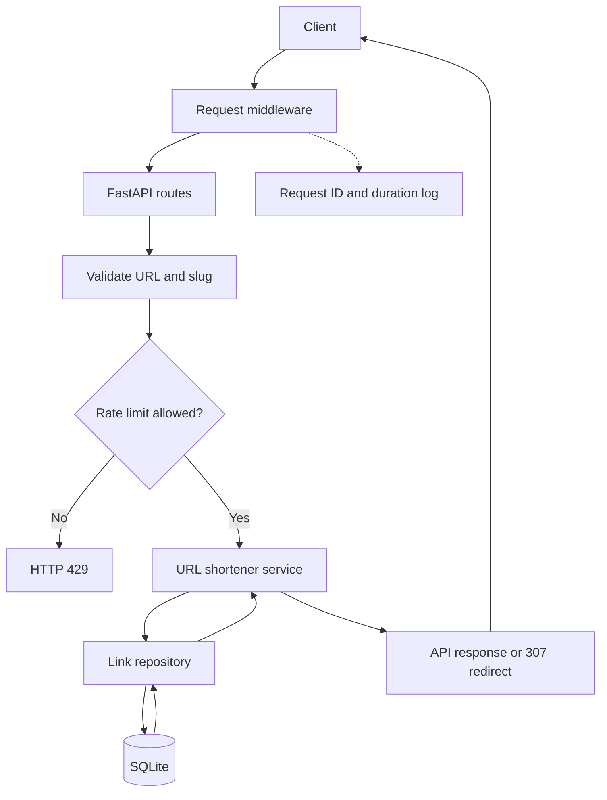
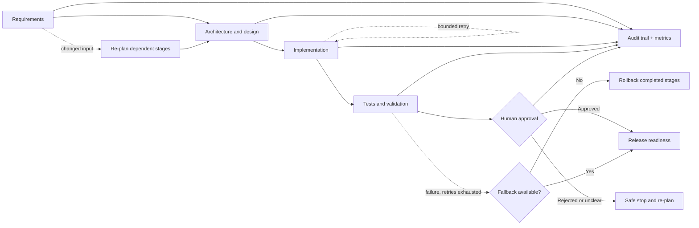

# Architecture and execution model

## Components

- FastAPI application: exposes the URL shortener endpoints
- SQLite database: stores link metadata and click events
- Link service: central business logic for creation, retrieval, redirect handling, and analytics
- Workflow graph (`app/orchestration.py`): governs dependency ordering, parallel synchronization, retries, fallback, rollback, approval gates, policy guardrails, re-planning, and reliability metrics
- Scenario builders (`app/scenarios.py`): runnable greenfield/brownfield/ambiguous workflows wired to the real service
- Request middleware: supplies request IDs and duration logs
- Rate limiter: applies a bounded per-client creation limit before writes

## Execution flow

1. A client posts a URL to /api/links.
2. The service validates the URL and checks custom slug constraints.
3. A unique short code is generated or a provided slug is reserved.
4. The original URL and short code are persisted to SQLite.
5. Redirect requests hit /{short_code}, update the click counter, and return a 307 redirect.
6. Analytics requests query click count and recent events for the short code.

API requests preserve a caller-provided `X-Request-ID` or generate one, then log the method,
path, status, and duration. Link creation uses a configurable fixed-window in-memory limiter.
This is appropriate for a single-process prototype; a multi-instance deployment should use a
shared store such as Redis.

## Runtime request flow

## Governed agentic workflow

## Orchestration design

`app/orchestration.py` implements `WorkflowExecutionGraph`, a stateful, resumable
executor over a graph of `WorkflowStep` nodes. It satisfies each governance
requirement concretely rather than only conceptually:

- **Explicit dependency graph with entry/exit gates**: each step declares
  `depends_on`; an optional `entry_gate` validates preconditions before a step may
  run (used to safe-stop on ambiguous/unclarified requirements), and an optional
  `exit_gate` validates a step's output before it is accepted as complete.
- **Sequential and parallel paths with synchronization**: on every iteration, all
  steps whose dependencies are satisfied are computed as one "ready" batch and
  executed concurrently via a thread pool, then the graph synchronizes (joins) before
  computing the next batch — a non-linear, wave-based scheduler rather than a linear
  script.
- **Cross-stage context and decision lineage**: every completed step's output is
  merged into `graph.context`, which is passed to every subsequent stage's task
  runner. `provide_context()` records externally supplied decisions (e.g. a
  stakeholder clarifying an ambiguous requirement) with an auditable reason.
- **Human approval checkpoints**: steps marked `approval_required=True` safe-stop the
  run with status `awaiting_approval` instead of raising — the caller resumes by
  calling `run(human_approval=True)` once approval is granted, without losing any
  already-completed work.
- **Bounded retries, fallback, rollback, safe-stop**: each step has a `retries`
  budget; when exhausted, an optional `fallback` task runner is invoked as a
  degraded/safe alternative. If neither retries nor fallback succeed, the graph
  triggers `rollback` handlers on every previously completed step, in reverse
  execution order, and returns status `rolled_back`. Deadlocked or blocked graphs
  return a `blocked` status rather than crashing the process (safe-stop).
- **Policy guardrails**: `policy_guardrails` is a list of pluggable checks run before
  every step; the built-in `default_policy_guardrail` enforces change control by
  refusing to run any `critical` step that is not also gated by human approval.
- **Audit-grade observability and traceability**: every state transition (retry,
  fallback, rollback, block, approval, completion, replan, context update) is
  appended to `graph.audit_log` with stage name, status, and reason.
- **Reliability metrics**: `get_metrics()` (included in every result) reports
  `success_rate`, `retry_count`, `rollback_count`, `mttr_ms` (mean time between a
  step's first failure and its eventual recovery), and `end_to_end_latency_ms`.
- **Dynamic re-planning**: `replan()` merges new or modified steps into a running
  graph — for example, adding a data-retention job once an ambiguous requirement is
  clarified — while refusing to touch already-completed steps, so decision lineage
  is preserved across the re-plan.

## Three scenarios (runnable)

`app/scenarios.py` builds real `WorkflowExecutionGraph` instances wired to
`UrlShortenerService` (not mocked/canned) for all three required scenarios:

- `build_greenfield_workflow()` — requirements → design → implementation → validation
  → release (approval-gated), exercising the happy path end-to-end against the
  actual service.
- `build_brownfield_workflow()` — impact analysis → design → implementation →
  regression tests → release, modeling an "add link expiration" enhancement. The
  first implementation attempt fails (simulated migration timeout) to exercise
  bounded retries; passing `force_regression_failure=True` exercises rollback of the
  completed implementation stage.
- `build_ambiguous_workflow()` — requirements → design → implementation → validation
  → release, where design's entry gate blocks (safe-stop) until both open questions
  (custom slug case sensitivity, analytics retention window) are supplied via
  `graph.provide_context("clarification", {...})`, then resumes.

See [docs/scenarios.md](scenarios.md) for full walkthroughs and
[tests/test_scenarios.py](../tests/test_scenarios.py) for executable proof.

## Risk control and safety

- Validate inputs before writes
- Accept only HTTP and HTTPS destination URLs
- Rate-limit write endpoints to reduce abuse
- Fail closed for duplicate custom slugs
- Log all-stage outcomes for review
- Require human approval before release-related stages
- Keep retries bounded to avoid infinite loops or runaway automation

## Production considerations

For a real deployment, the prototype would evolve to include:

- PostgreSQL or Redis-backed storage
- authn/authz controls
- rate limiting and abuse detection
- observability dashboards and distributed tracing
- deployment pipelines with policy enforcement
