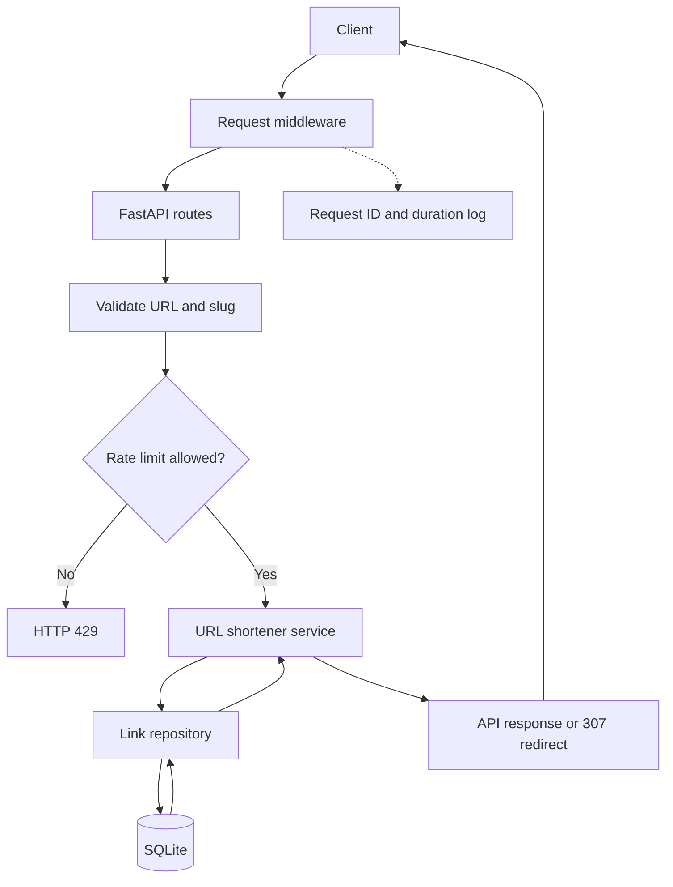
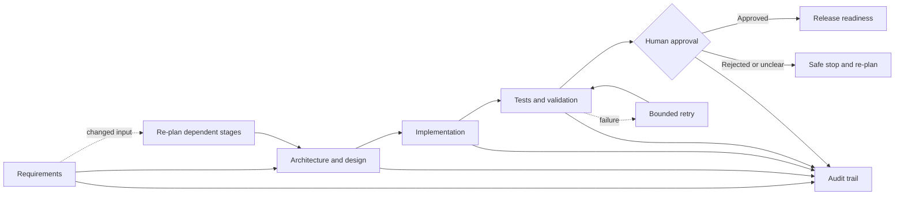

# Architecture and execution model

## Components

- FastAPI application: exposes the URL shortener endpoints
- SQLite database: stores link metadata and click events
- Link service: central business logic for creation, retrieval, redirect handling, and analytics
- Workflow graph: governs dependency ordering, retries, and approval checkpoints
- Request middleware: supplies request IDs and duration logs
- Rate limiter: applies a bounded per-client creation limit before writes

## Execution flow

1. A client posts a URL to /api/links.
2. The service validates the URL and checks custom slug constraints.
3. A unique short code is generated or a provided slug is reserved.
4. The original URL and short code are persisted to SQLite.
5. Redirect requests hit /{short_code}, update the click counter, and return a 307 redirect.
6. Analytics requests query click count and recent events for the short code.

API requests preserve a caller-provided `X-Request-ID` or generate one, then log the method,
path, status, and duration. Link creation uses a configurable fixed-window in-memory limiter.
This is appropriate for a single-process prototype; a multi-instance deployment should use a
shared store such as Redis.

## Runtime request flow

## Governed agentic workflow

## Orchestration design

The orchestration layer is intentionally simple but faithful to the assignment objectives:

- explicit dependency graph
- sequential execution order
- parallel-ready stage selection
- audit log of stage outcomes
- human approval gate for sensitive stages
- retry loop with bounded attempts
- safe-stop when execution is blocked

This means the system is not just a linear script. It is stateful and traceable, and it maintains a record of the engineering lifecycle decisions.

## Risk control and safety

- Validate inputs before writes
- Accept only HTTP and HTTPS destination URLs
- Rate-limit write endpoints to reduce abuse
- Fail closed for duplicate custom slugs
- Log all-stage outcomes for review
- Require human approval before release-related stages
- Keep retries bounded to avoid infinite loops or runaway automation

## Production considerations

For a real deployment, the prototype would evolve to include:

- PostgreSQL or Redis-backed storage
- authn/authz controls
- rate limiting and abuse detection
- observability dashboards and distributed tracing
- deployment pipelines with policy enforcement
